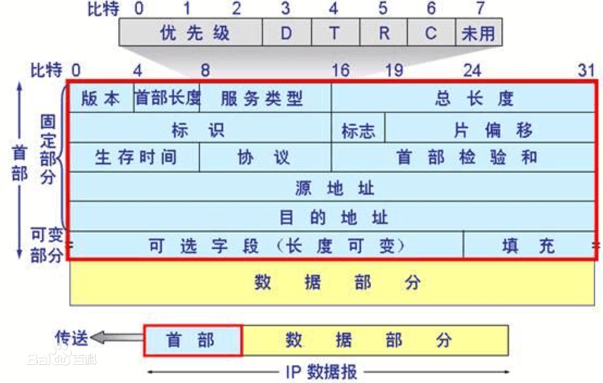

# name and addresses:IPv4




IP首部一共20个字节：
版本：IPv4
两个address长度各是32bits:  
a.b.c.d  
子网掩码：如果匹配，则在同一网络环境下，例如：    
255.255.255.0 子网掩码下的
a.b.c.d 和 a.b.c.e 在同一网络环境下

linux 下看 IP：
```bash
$ ifconfig
...
inet 192.168.2.122  netmask 255.255.255.0  broadcast 192.168.2.255
...
```
这意味着如果我发送的是 192.168.2.X，则可以直接发送，如果不是，则要通过路由。
>多个IP地址与子网掩码按位与得到的结果，相等的处于同一网络下，交换数据时不需要穿过路由，不相等则处于不同网络下，需要穿过路由。

## 如今的地址结构
无类域间路由（Classless Inter-Domain Routing、CIDR）是一个用于给用户分配IP地址以及在互联网上有效地路由IP数据包的对IP地址进行归类的方法。
- 地址块是一对:address,count
- count 为2的幂，指定子网掩码长度
- 171.64.0.0/16 表示 171.64.0.0 到 171.64.255.255 范围内的任何地址
- A/24 描述 256 个地址，A/20 描述 4,096 个地址

## IPv4 Address Assignment
IANA: Internet Assigned Numbers Authority 互联网分配数字管理局

