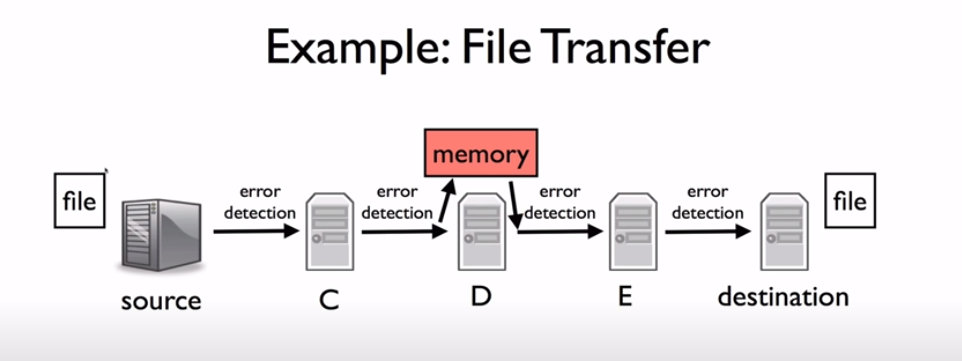

# The End-to-End Principle

A B间我文件传输
- 打开 A B 的 TCP 连接
- 读取 A 上的文件将其写入 TCP 连接
- B 从 socket 中提取文件并写入 B

为什么 network 不提供更多帮助？如加密、压缩文件、合并文件、跨区域连接等等。
- 因为端对端原则

## 为什么端对端
  
- 图中网络中有 error detection
- 在 D 中遇到了 memory 翻转的 bug
- error detection 只是检测传输造成的 error,但不能检测储存的 error,因此必须在 destination 重新组合后才能发现问题

## 另一个原则 "强"端对端
network 的工作是传递 datagrams 尽可能高效且灵活。其他的所有东西都应该在边缘。——RFC 1958
这个原则很好，提高了灵活性。但现在遵守的不多。这使得 network 性能越来越好，但越来越难以改变。