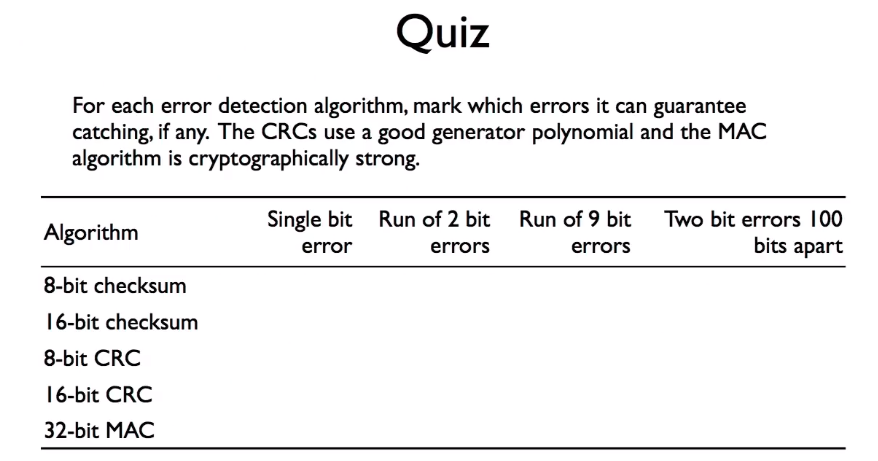
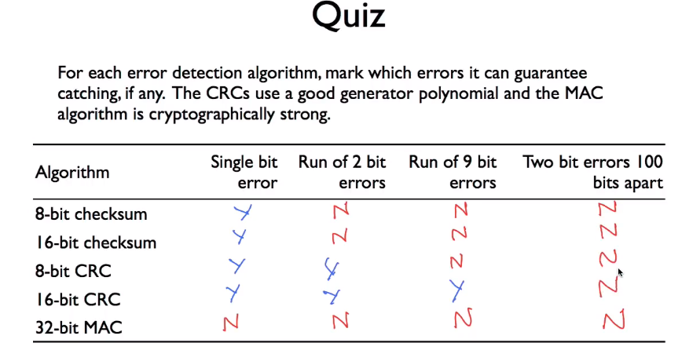

# Error Detection:3 schemes（Checksum,CRC and MAC）

## 三种错误检测模式

- Checksum 将数据包中的值相加(IR，TCP)
    - 非常快，即使在软件中计算也很便宜
    - 不是很健壮
- Cyclic redundancy code(循环冗余码CRC) 计算多项式的余数(Ethernet)
    - 比 Checksum 更贵(今天很简单，硬件里很简单)
    - 防止任何2位错误, any burst <= c bits long,任何奇数个错误
- Message authentication code（消息身份验证代码 MAC）:cryptographic transformation of data（数据的加密转换）(TLS)
    - Robust to malicious(恶意的) modifications,but not errors
    - If strong,任何 2 个消息 have a 2^(-c) chance of having 相同的代码

## IP Checksum
- IP、UDP和TCP使用各自的补码校验和算法:
- 计算 Checksum
    - 将 Checksum 字段设置为 0，对数据包中所有 16-bit words 求和
    - 将进位加入低16位: 
      - 0x8000 + 0x8000 = 0x10000 
      - 0x0001 + 0x0000 =  0x0001
    - 取反码(OxC379 becomes 0x3C86), 除非是 OxFFFF, then checksum is OxFFFF 
- 检查 Checksum
  - 包括 Checksum 在内的所有数据包的总和应为 0xFFFF

- Benefits: 快速，易于计算和检查
- Drawbacks: 错误检测性能低
  
## CRC(Cyclic Redundancy Check 循环冗余检验) Link layer
- CRC: 将n位数据提取为c位，c<<n
  - 有 2^(-c) 的概率检测不到 error
- CRC设计用于检测某些形式的错误:比校验和更强
  - 奇数位错误
  - 2 bits in error
  - Any message with a single burst(突发) of error <=  c bits long 
- 链接层通常使用CRC
  - 在硬件上快速计算
  - Can be computed incrementally (增量)，在读取 packet 时可以同时计算
  - 良好的物理层突发错误检测 

###  CRC如何计算：
- 把消息看出0、1的多项式
- 使用生成多项式G，由于历史原因要多一位，在最前面的第一项是1
- 在消息的最后加等于 CTC 长度的0
- 除以生成多项式G 得到余数
- 带 CRC 的 message 除以生成多项式G，余数为 0 则无错误

## MAC(消息验证码，message authentication code)
不是 MAC地址（英语：Media Access Control Address）

- 使用密码学生成 c = MAC(M,s)，|c| << |M|
  - 没有 s 很难生成c
  - 很难生成 M （c 是 s)
    - 这意味着 M+c 代码可能有其他人有这个密码 
- 密码学意义上的强MAC意味着翻转M的一个位导致新c中的每个位都是随机的1或0(无信息)
  - Mac 没有错误检测（反转一位也是个消息验证码）
  - 用来抵御敌人

## Quiz

## 实践中
常使用多层错误检测,如
link layer 通常用 CRC
IP 用 checksum
TCP 用 checksum
应用程序 用自己的 错误检测 （安全传输层协议（TLS））
