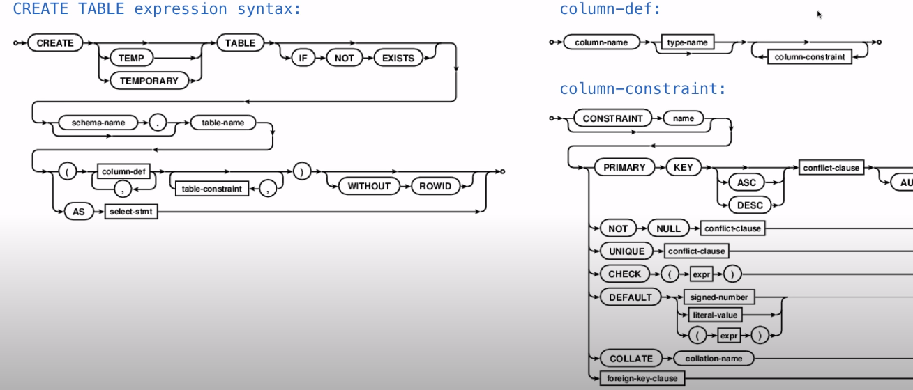
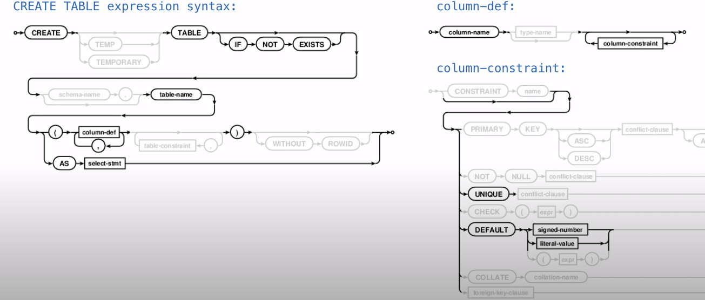
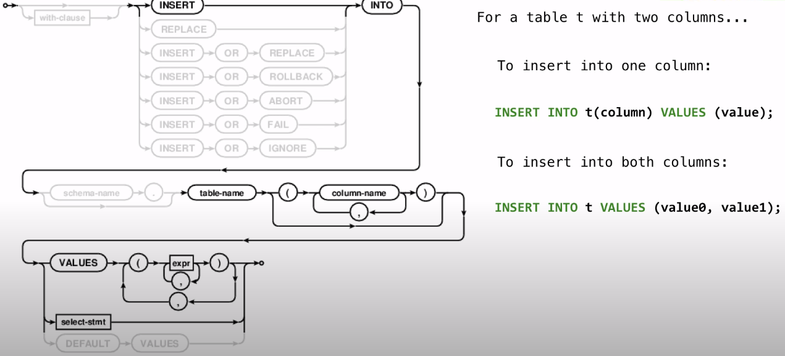
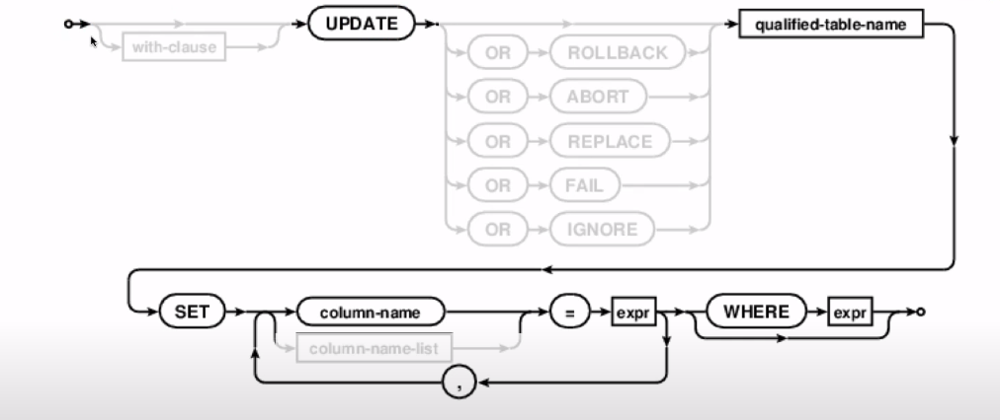

# Databases
## Create Table


- 我们忽略一些细节后的精简版本


例子：
```SQLite
CREATE TABLE numbers (n, note);
CREATE TABLE numbers (n UNIQUE, note);
CREATE TABLE numbers (n, note DEFAULT "No comment");
```

## Drop Table

- 使用` if exists `如果不存在会 报错

## Modifying Tables
### Insert


### Update


### Delect


## Example
```SQLite
sqilte> create table primes(n, prime);
sqilte> drop table if exists primes;
sqilte> select * from primes;
Error: no such table: primes
sqilte> create table primes(n UNIQUE, prime DEFAULT 1); -- SQLite 中没有 boolean
sqilte> select * from primes;
sqilte> INSERT INTO primes VALUES (2, 1), (3, 1);
sqilte> select * from primes;
2|1
3|1
sqilte> INSERT INTO primes(n) VALUES (4), (5), (6), (7);
sqilte> select * from primes;
2|1
3|1
4|1
5|1
6|1
7|1
sqilte> INSERT INTO primes(n) SELECT n+6 FROM primes;
sqilte> select * from primes;
2|1
3|1
4|1
5|1
6|1
7|1
8|1
9|1
10|1
11|1
12|1
13|1
sqilte> UPDATE primes SET prime=0 WHERE n>2 AND n%2=0;
sqilte> UPDATE primes SET prime=0 WHERE n>3 AND n%3=0;
sqilte> UPDATE primes SET prime=0 WHERE n>5 AND n%5=0;
sqilte> select * from primes;
2|1
3|1
4|0
5|1
6|0
7|1
8|0
9|0
10|0
11|1
12|0
13|1
sqilte> DELECT FROM primes HERE prime=0;
sqilte> select * from primes;
2|1
3|1
5|1
7|1
11|1
13|1
```

## Python and SQL
```python
import sqlite3

# sqlite3 有一个 Connection 类，连接 database file
db = sqlite3.Connection("n.db")
db.execte("CREATE TABLE nums AS SELECT 2 UNION SELECT 3;")
db.execte("INSERT INTO nums VALUES (4), (5), (6);")
db.execte("INSERT INTO nums VALUES (?), (?), (?);", range(7,10))
print(db.execte("SELECT * FROM nums;").fetchall())  # 返回一个 cursor object,有个 fetchall 方法，把结果以元组形式表述出来
# [(2,),(3,),(4,),(5,),(6,),(7,),(8,),(9,)]

# 当你修改一个 table,确保代表 database 的文件要保存了所有的更改，需要多用一个方法
db.commit()
```

## SQL 注入攻击
```python
name = "Robert'); DROP TABLE Students; --"
cmd = "INSERT INTO Students VALUES ('" + name + "');"
db.executescript(cmd)
```
```SQLite
INSERT INTO Students VALUES ('Robert'); DROP TABLE Students; -- ');
```
解决方法：
```python
name = "Robert'); DROP TABLE Students; --"
db.execute("INSERT INTO Students VALUES (?);", [name])  # 这种方式把字符串正确地转义了
```
```SQLite
INSERT INTO Students VALUES ('Robert''); DROP TABLE Students; --');
```

## Database Connections
多个程序可能同时连接到同一数据库，可能从同一 table 上插入值或者读取值。
- 数据库可以处理同一数据库进行多个连接、多个客户端改变同一个 table 的情况

例子: 21点游戏， `python` 程序连接数据库来执行游戏， `eval-print-loop` 也连接数据库来看牌
```python
# Blackjack

points = {'A': 1, 'J': 10, 'Q': 10, 'K':10}
points.update({n: n for n in range(2, 11)})  # 每个牌所对应的分数

def hand_score(hand):
    """Total score for a hand."""
    total = sum([points[card] for card in hand])  # 手上所有牌的大小
    if total <= 11 and 'A' in hand:               # 'A' 有 1 和 11 两种情况
        return total + 10
    return total

db = sqlite3.Connection('cards.db')              # 连接数据库
sql = db.execute
sql('DROP TABLE IF EXISTS cards')
sql('CREATE TABLE cards(card, place);')          # 创建 cards 表，里面有 card, place(对应who) 两列

def play(card, place):
    """Play a card so that the player can see it."""
    sql('INSERT INTO cards VALUES (?, ?)', (card, place))  # 插入 card, place 到 cards
    db.commit()

def score(who):
    """Compute the hand score for the player or dealer."""
    cards = sql('SELECT * from cards where place = ?;', [who])    # who 所包含的所有 rows
    return hand_score([card for card, place in cards.fetchall()])

def bust(who):
    """Check if the player or dealer went bust."""
    return score(who) > 21

player, dealer = "Player", "Dealer"

def play_hand(deck):
    """Play a hand of Blackjack."""  # 抽牌，dealer 一张牌翻盖
    play(deck.pop(), player)         # desk 是一个list, 列出所有 points 的 keys 数量 * 4
    play(deck.pop(), dealer)
    play(deck.pop(), player)
    hidden = deck.pop()

    while 'y' in input("Hit? ").lower():  # 按 'y' 抽牌
        play(deck.pop(), player)
        if bust(player):                  # 超过 21 点？
            print(player, "went bust!")
            return

    play(hidden, dealer)

    while score(dealer) < 17:            # dealer 逻辑，只要小于 17 分就抽牌
        play(deck.pop(), dealer)
        if bust(dealer):
            print(dealer, "went bust!")
            return

    print(player, score(player), "and", dealer, score(dealer))

deck = list(points.keys()) * 4
random.shuffle(deck)                    # 洗牌 （random 列表）
while len(deck) > 10:                   # 开始打牌
    print('\nDealing...')
    play_hand(deck)
    sql('UPDATE cards SET place="Discard";')
```
