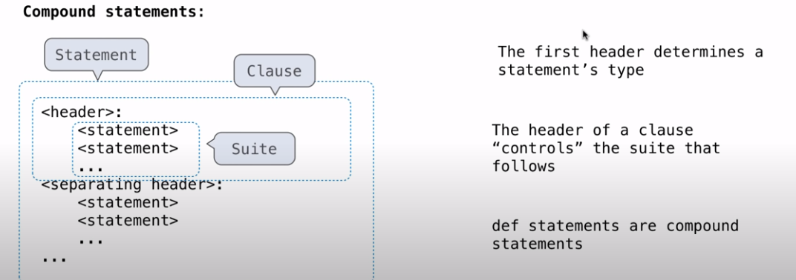
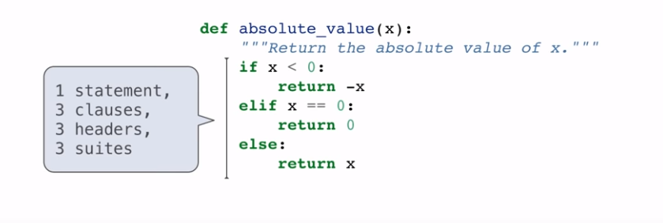
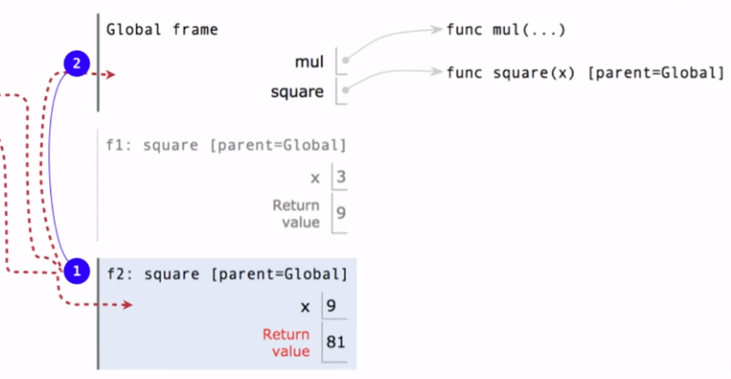

# Control

## 复合语句

```python
<header>:
    <statement>
    <statement>
    ...
<separating header>:
    <statement>
    <statement>
    ...
...
```




- 头部特化的求值规则
  - 指导了组内的语句什么时候被执行、是否会被执行
- 多行程序的定义：
  - 要想执行语句序列，先要执行第一条语句。如果这个语句不是重定向控制，执行语句序列的剩余部分（如果存在的话）。
    - 一个序列可以划分为它的第一个元素和其余元素。
    - 语句序列的“剩余”部分也是一个语句序列。
    - 我们可以递归应用这个执行规则。

## 定义函数 II：局部赋值
- 赋值语句的效果是在当前环境的第一个帧上，将名字绑定到值上
- 函数体内的赋值语句不会影响全局帧
- 局部赋值也可以将名称赋为间接量

### Names Have No Meaning Without Environments
- 每个表达式 is evaluated in the context of an environment
- A name evaluates to the value(名称的计算结果) bound to that name(绑定到这个名字) in the earliest frame of the current environment(在当前环境的最早框架中) in which that name is found.

## 条件语句
```python 
if <expression>: # 布尔上下文
    <suite>
elif <expression>:
    <suite>
else:
    <suite>
```

- 布尔上下文
  - 它们值的真假对控制流很重要
  - 它们的值永远不会被赋值或返回
  - Python 包含了多种假值
    - 0、None、False
- 短路
  - True or False # True
    - ```<right>```不一定会执行

## 迭代
- 为了防止while子句的语句组无限执行，它应该总是在每次通过时修改环境的状态。
- 不终止的while语句叫做无限循环。按下```<Control>-C```可以强制让 Python 停止循环。

## 实践指南：测试
- 验证函数的行为是否符合预期的操作
- 通常写为另一个函数
  - 这个函数包含一个或多个被测函数的样例调用
  - 测试涉及到挑选特殊的参数值
  - 测试也可作为文档(文档测试)
- **断言**
  - 使用 ```assert``` 语句来验证预期
    - 例如测试函数的输出
    - ```assert``` 语句在布尔上下文中只有一个表达式，后面是带引号的一行文本（单引号或双引号都可以）
    - 如果表达式求值为假，表达式就会显示。
``` python
assert fib(8) == 13, 'The 8th Fibonacci number should be 13'
```
- 为真时，没有任何效果
- 当它是假时，会造成执行中断
```python
>>> def fib_test():
        assert fib(2) == 1, 'The 2nd Fibonacci number should be 1'
        assert fib(3) == 1, 'The 3nd Fibonacci number should be 1'
        assert fib(50) == 7778742049, 'Error at the 50th Fibonacci number'
```
- 测试可以写在同一个文件，
- 或者后缀为_test.py的相邻文件中

## Doctest
- Python 提供了一个便利的方法，将简单的测试直接写到函数的文档字符串内。
  - 第一行应该包含单行的函数描述
  - 后面是一个空行。
  - 参数和行为的详细描述跟随在后面。

```python
>>> def sum_naturals(n):
        """Return the sum of the first n natural numbers

        >>> sum_naturals(10)
        55
        >>> sum_naturals(100)
        5050
        """
        total, k = 0, 1
        while k <= n:
          total, k = total + k, k + 1
        return total
```

可以使用 doctest 模块来验证交互。
```python
>>> from doctest import run_docstring_examples
>>> run_docstring_examples(sum_naturals, globals()) # globals函数返回全局变量的表示，解释器需要它来求解表达式。
```
- 可以通过以下面的命令行选项启动 Python 来运行一个文档中的所有 doctest。
```bash
python3 -m doctest <python_source_file>
```
- 高效测试的关键是
  - 在实现新的函数之后（甚至是之前）立即编写（以及执行）测试。
- 只调用一个函数的测试叫做单元测试。
- 详尽的单元测试是良好程序设计的标志。
