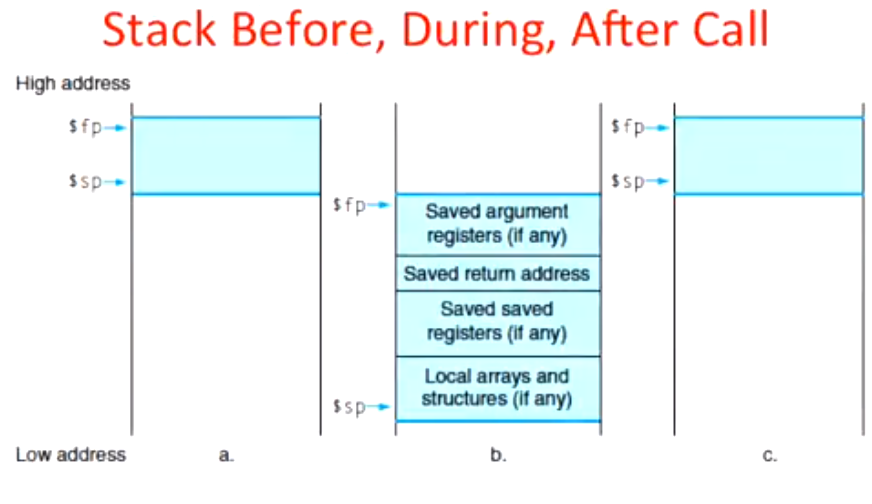
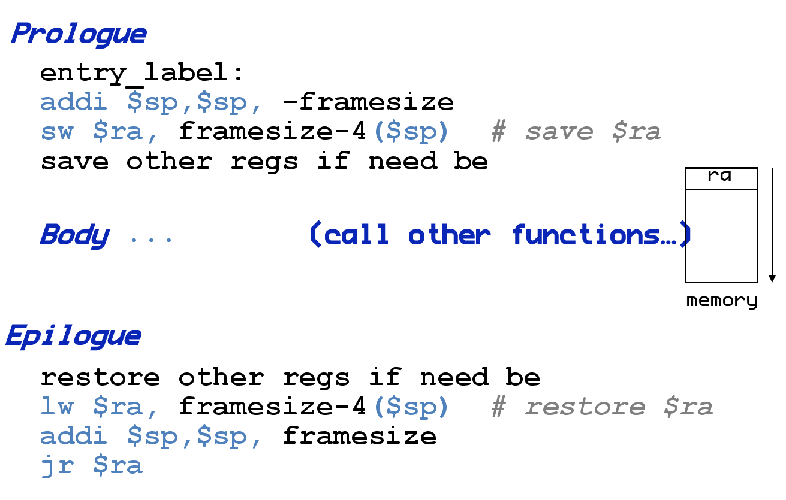
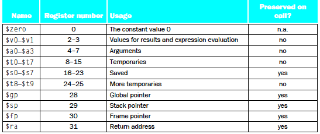

# MIPS, MIPS Functions	

## Six Fundamental Steps in  Calling a Function

1. 将 parameters 放在 function 可以 access 它们的地方
2. 将控制转移到 function
3. 获取 function 所需的 (local) storage resources
4. 执行期望的 function 任务
5. 将 result value 放在 calling program 可以 access 它的地方，并恢复使用的任何寄存器( restore any registers you used)
6. 将 control 返回到原始点( point of origin)，因为一个 function 可以从程序中的多个位置调用

## MIPS Function 调用约定
- Registers faster than memory, so use them
- $a0–$a3: 四个参数(argument)寄存器来传递参数
- $v0–$v1: 两个值(value)寄存器返回值
- $ra:一个返回地址(return address)寄存器，返回到 point of origin

```c
 ... sum(a,b);... /* a,b:$s0,$s1 */
 int sum(int x, int y) { 
     return x+y;
 }
```
在MIPS中，所有指令都是4字节的，并且像数据一样存储在内存中。这里我们显示了程序存储的地址。
 |address (shown in decimal)|Instruction Support for Functions|
 |:----:|:----:|
 |1000|```add $a0,$s0,$zero  # x = a```|
 |1004|```add $a1,$s1,$zero  # y = b ```|
 |1008|```addi $ra,$zero,1016 # $ra = 1016```|
 |1012|```j sum # jump to sum```| 
 |1016|``` … # next instruction```|
 |…|…|
 |2000|``` sum: add $v0,$a0,$a1```| 
 |2004|```jr $ra # new instruction```|
问:为什么在这里使用 jr ?为什么不用 j 呢?

 答:sum 可能会被很多地方调用，所以我们不能返回到一个固定的位置。调用 sum 的程序必须能够以某种方式说““return here”。

单指令跳转并保存返回地址: jump and link  (jal)

```mips
Before:  
1008 addi $ra,$zero,1016 #$ra=1016
1012 j sum               #goto sum
After: 
1008 jal sum             # $ra=1012,goto sum
```
- Why have a jal
  - 快速处理常见情况:
    - 函数调用非常常见。
  - 使用 jal 不必知道代码在内存中的位置!

## MIPS函数调用指令
- 调用函数: jump and link instruction (jal)
  - “link” 是指形成一个指向 calling site 的 address or link，以使函数返回到正确的地址
  - 跳转到地址，同时将下面的指令地址保存在寄存器 $ra 中  
  ```jal FunctionLabel```
- 函数返回:跳转寄存器指令 jump register instruction (jr) 
  - 无条件跳转到寄存器中指定的地址  
  ``` jr $ra```

## Notes on Functions
- 调用程序(caller)将参数放入寄存器 ```$a0-$a3``` 中，并使用 ```jal X``` 在地址X处调用(callee)
- 必须在计算机中有 register with 当前执行指令的地址
  - 代替Instruction Address Register (更好的名字)，历史上称为 Program Counter (PC)
  - It’s a program’s counter; it doesn’t count programs!
- What value does jal X place into $ra? 
- jr $ra puts address inside $ra back into PC

## Where Are Old Register Values Saved to Restore Them After Function Call? 
旧的寄存器值保存在哪里,以在函数调用后还原它们?

- 需要在调用函数前保存e values ，返回时还原，然后删除
- Ideal is stack: 后进先出队列 (e.g., stack of plates)
- 堆栈在内存中，所以需要寄存器指向它
- $sp是MIPS中的堆栈指针
- 公约 是从高到低的地址增长
  - Push 降低 $sp
  -  Pop 增量 $sp

```c
int leaf_example (int g, int h, int i, int j)
{
	int f;
	f = (g + h) – (i + j);
	return f;
}
```
- Parameter variables g, h, i, and j in argument registers $a0, $a1, $a2, and $a3, and f in $s0
  
- Assume need one temporary register $t0

Stack Before, During, After Function
- Need to save old values of $s0 and $t0


```mips
addi $sp,$sp,-8 # adjust stack for 2 items
sw $t0, 4($sp)  # save $t0 for use afterwards
sw $s0, 0($sp)  # save $s0 for use afterwards

add $s0,$a0,$a1 # f = g + h
add $t0,$a2,$a3 # t0 = i + j
sub $v0,$s0,$t0 # return value (g + h) – (i + j)

lw $s0, 0($sp)  # restore register $s0 for caller
lw $t0, 4($sp)  # restore register $t0 for caller
addi $sp,$sp,8  # adjust stack to delete 2 items
jr $ra          # jump back to calling routine
```

## What If a Function Calls a Function? Recursive Function Calls?

- Save $ra on the stack

```c
int sumSquare(int x, int y) {
  return mult(x,x)+ y;
}
```
- Something 调用 sumSquare, now sumSquare 调用mult.
- 所以在$ra中有一个值是 sumSquare 想要返回的，但是这个值会被对 mult 的调用覆盖。
- 在调用 mult 之前需要保存 sumSquare 返回地址。
  
- 一般来说，可能需要保存一些其他信息(除了$ra)。
- 当C程序运行时，分配了3个重要的内存区域:
  - Static:每个程序声明一次的变量，只有在执行完成后才停止存在——例如，C全局变量
  - heap:通过malloc动态声明的变量
  - Stack:执行过程使用的空间;这是我们可以保存  register values
 的地方
 ## Optimized Function Convention

 - 为了减少昂贵的负载(loads)和存储对寄存器的溢出和恢复，MIPS将寄存器分为两类:
 - Preserved across function call
   - Caller  可以依赖于值不变
   - $ra, $sp, $gp, $fp, “saved registers” $s0- $s7 
 - Not preserved across function call(在函数调用中没有保留)
   - Caller cannot rely on values being unchanged
   - Return value registers $v0,$v1, Argument registers $a0-$a3, “temporaryregisters” $t0-$t9

Which statement is FALSE?
- A:  MIPS uses ```jal``` to invoke a function and ```jr``` to return from a function 
- B: ```jal``` saves PC+1 in ```$ra```
- C: 	The callee can use temporary registers ```($ti)``` without saving and restoring them
- D: The caller can rely on the saved registers ```($si)``` without fear of callee changing them

answer

B: Print It saves PC+4

…because ints in this system are 4-bytes long and the actual address increments by 4 even though it appears to only increment 1.

## Allocating Space on Stack

- C语言有两个存储类:Automatic  和 static
  - 自动变量是函数的局部变量，在函数退出时被丢弃
  - 静态变量存在于过程的出口和入口之间 (Static variables exist across exits from and entries to procedures)

- Use stack for automatic (local) variables that don’t fit in registers
- 程序框架或激活记录(Procedure frame or activation record)
  - 保存寄存器和局部变量的 stack 段
  - 一些MIPS编译器使用一个帧指针($fp)来指向帧的第一个字



## Using the Stack
- 所以我们有一个寄存器$sp，它总是指向堆栈中最后使用的空间。
- 要使用堆栈，我们将这个指针减去我们需要的空间量，然后用 info 填充它。
- 那么，我们如何编译它呢?
```c
int sumSquare(int x, int y) {  
  return mult(x,x)+ y;
}
```

```mips
sumSquare:
  addi $sp,$sp,-8 # space on stack
  sw $ra, 4($sp)	 # save ret addr
  sw $a1, 0($sp)	 # save y
  add $a1,$a0,$zero # mult(x,x)
  jal mult 		   # call mult
  lw $a1, 0($sp)	 # restore y
  add $v0,$v0,$a1 # mult()+y 
  lw $ra, 4($sp)	 # get ret addr
  addi $sp,$sp,8  # restore stack
  jr $ra
mult: ...
```

## Basic Structure of a Function(函数的基本结构)


## Where is the Stack in Memory?
- MIPS convention
(MIPS 公约)
- 堆栈在高内存中开始并逐渐减小
  - Hexadecimal (base 16) : 7FFF FFFChex
- MIPS programs (text segment) in low end
  - 0040 0000hex
- static data segment(常量和其他静态变量)，在 text 上面的是静态变量
  - 全局指针($gp)指向 static
- heap 在 static 上方 grow and shrink; grows up to high addresses

## MIPS Memory Allocation


## Register Allocation and Numbering


## Conclusion
- 用 jal 调用函数，用 jr $ra 返回。
- 堆栈是你的朋友:使用它来保存你需要的任何东西。就让它保持原来的样子吧!
- Instructions we know so far…
  - Arithmetic: ```add, addi, sub, addu, addiu, subu```
  - Memory:	    ```lw, sw, lb, sb```
  - Decision:   ```beq, bne, slt, slti, sltu, sltiu```
  - Unconditional Branches (Jumps):  ```j, jal, jr```
- 到目前为止，我们知道的 Registers 
  - All of them!
  - ```$a0-$a3``` for function arguments, ```$v0-$v1``` for return values
  - ```$sp```, stack pointer, ```$fp``` frame pointer, ```$ra ```return address

## Recursive Function Factorial

```c
int fact (int n)
{
	if (n < 1) return (1);
			else return (n * fact(n-1));
}

```

```mips
Fact:# adjust stack for 2 items
	addi $sp,$sp,-8
	# save return address
	sw $ra, 4($sp) 
  # save argument n
	sw $a0, 0($sp) 
  # test for n < 1
	slti $t0,$a0,1 
	# if n >= 1, go to L1
	beq $t0,$zero,L1 
  # Then part (n==1) return 1
	addi $v0,$zero,1 
  # pop 2 items off stack
	addi $sp,$sp,8 
  # return to caller
	jr $ra
```
```mips
L1: 
	# Else part (n >= 1) 
  # arg. gets (n – 1)
	addi $a0,$a0,-1 
  # call fact with (n – 1)
	jal fact 
	# return from jal: restore n
	lw $a0, 0($sp) 
  # restore return address
	lw $ra, 4($sp) 
  # adjust sp to pop 2 items
	addi $sp, $sp,8 
  # return n * fact (n – 1)
	mul $v0,$a0,$v0 
  # return to the caller
	jr $ra

```

 