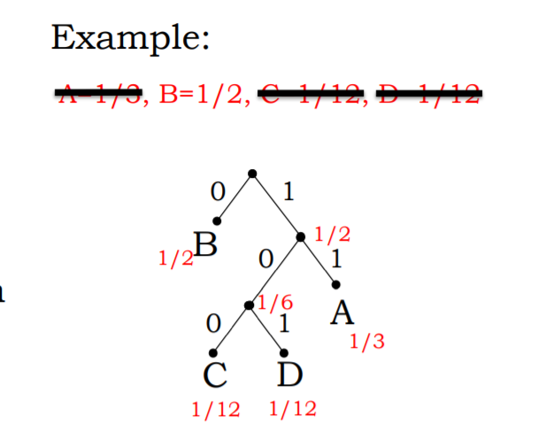

# 6.004.1x
内容：
1. 数字电路
2. 计算机体系结构
3. 计算机组成

## 数字电路
用电信号表示信息
- 设计逻辑门
  - 晶体管开关电路，可以简单操作编码信息
- 构建存储信息的内存组件
  - 执行计算序列的电路
- 构建任何数字系统所需的组件

## 信息
 传达或接收的数据，以解决某一特定事实或情况的不确定性。
 (Data communicated or received that resolves uncertainty about a particular fact or circumstance.)

### 不确定性
概率越高，得到的信息量 `I(Xi)` 越多，不确定越低

`I(Xi)=log2(1/Pi)`
- 使用 `log2` 是因为这样就可以用二进制表示

### 平均信息量（熵）
平均信息量（熵）是我们需要传输的信息的下限。

低于这个量，会导致工作失败；  
高于这个量，不能最高效利用我们的资源。

发送精确的 `H(X)`，会获得完美的编码
- `H(X) = E(I(X)) = sum(Pi * I(Xi))`

比如，ASCII 有 94 个打印字符，平均信息量是 `log2(94) = 6.555`

## encodings (编码)
encodings 是**位字符串**与**编码的数据集**间的明确映射
(An encoding is an unambiguous mapping between **bit strings** and 
**the members of the set of data to be encoded**. )

一般有两种编码方式。固定长度编码和可变长度编码。

## 固定长度编码
用于表示符号的位字符串具有相同的长度。

`00 -> A` ， `01 -> B`，`ABBA -> 00-01-01-00`

### 优点
- 支持随机访问，可以在任意位置开始解码：想确定编码的第三个符号，可以跳过前两个符号

### 缺点
- 不能高效利用资源

#### 例子：表示十进制数字
十进制数字（10 个数字），计算平均信息量(熵)：  
`H(X) = E(I(X)) = sum(Pi * I(Xi)) = sum((1/N) * log2(1/(1/N))) = sum(1/N)log2(N))`，  
化简得 `H(X) = log2(N)`。  
十进制数字（10 个数字）关联的熵是 `log2(10) = 3.322`

使用固定长度编码，十进制数字需要 4 位来表示，效率低

### 可变长度编码
使用不同长度的位表示编码符号
  - `01 -> A` , `1 -> B`, `11 -> C`
  - `ABBA` -> `01-1-1-01`
  
可变长度编码会出现无法解码的问题，如果编码不明确，则由编码反推原码无唯一解

解决方法：
- 使用二叉树的编码方式， 符号是叶子节点， 0 为左侧，1 为右侧

## 二进制补码
- 最大的负数：`0b10000`
- 最大的正数：`0b01111`
- -1: `0b11111`
- -1 + 1 = `0b11111+0b00001` = `0b00000` = `0`
- `A+(-A)=0=-1+1` => `-A = (-1 - A) + 1` => `-A = ~A + 1`
  - `-1 - A` = `0b11111 - A` = `~A` 

## 变长编码
如果每个元素出现的概率不同，则使用变长编码形式
- 理想情况下，编码长度与 H(X) (预期信息长度) 匹配
- 对于每个元素出现概率概率越大，H(X) 越小，使用的编码更短

|choice|p|encoding|
|:---:|:---:|:---:|
|"A"|1/3|11|
|"B"|1/2|0|
|"C"|1/12|100|
|"D"|1/12|101|
`H（X）= (2)(1/3) + (1)(1/2) + (3)(1/12) + (3)(1/12) = 1.667 bits`

1000 个 symbol:
- 定长编码 = 2000 bits
- 变长编码 = 1667 bits
- 长度下限 = 1626 bits

## 霍夫曼算法
霍夫曼算法解决了如何构建最佳可变长度编码的问题

步骤：
1. 首先选择**概率最小**的两个符号/子树，形成一个二叉树，这个二叉树**父节点的概率是这两个符号之和**
2. 在符号列表中删除这两个元素
3. 子树加入符号列表
4. 以此类推，递归形成一棵二叉树

## 编码如果发生错误怎么检测

使用汉明距离（相同长度编码，相同位置数字不同的个数），添加一个校验和来生成所需的集合  
最简单的错误检测码：奇偶校验和
 
偶检验和
  - 添加一位使得1的个数位偶数
  - 如果1的个数位奇数则错误
  
奇偶校验和的特点
- 要检测 E 个错误，需要最小汉明距离为 E + 1
- 要纠正 E 个错误，需要最小汉明距离为 2E + 1 
  

## jade
https://computationstructures.org/exercises/sandboxes/jade.html

  