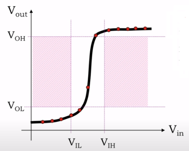
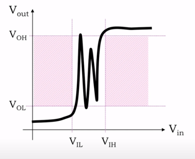
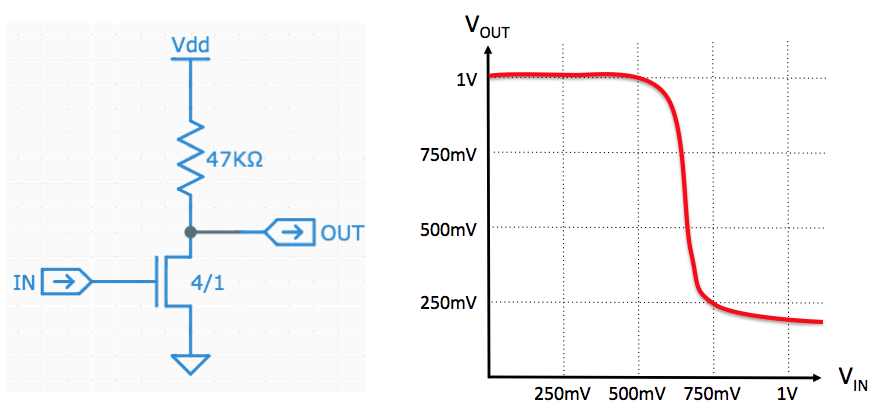
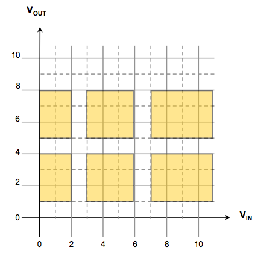

# The digit abstraction
为比特寻找物理表示  
物理表示的要求
- 小而廉价
- 长期稳定
- 容易处理并且速度很快：快速访问、转换、组合、传输和存储它们所编码的信息

## 利用与带电粒子相关的电现象来表示信息
用电现象来表示信息
  - 带电粒子产生电势能差
  - 用电压来表示电势能差
  - 用电流来测量带电粒子的流动 
  
### 使用电压的表示方法的优缺点
优点
- 廉价、可靠的电力
- 业界有成熟使用小电路存储、检测、操纵电压的方式
- 可以极小的电力下运行
- 可以设计出在稳定状态下需要接近零功耗的电路

缺点
- 容易受到周围环境中不断变化的电磁场的影响
- 需要通过电线连接
- 改变电压需要时间

## 电路直接模拟现实不可行
完美复制信息是不存在的
  - 每个模块都会有一定的误差，`1%` 的误差，`0.5V` 对应的范围为 `0.495V ~ 0.505V`
- 随着系统的增大，累积的错误也会增加

`50` 个模块串联，每个模块 `1%` 的误差，`0.5V` 对应的整体误差范围在 `0.5*(0.99^50)V ~ 0.5*(1.01^50)V = 0.302V ~ 0.822V`

## 解决方案：使用数字抽象（digital abstraction）
用连续的电压来表示一些小的、有限的值集（“0”，“1”）
- 关键思想
  - 有一个信号约定，每次只编码一个信息位，即 "0 "或 "1 "两个值中的一个。

对数字系统使用相同的统一表示方法
  - 尝试1：
    - 给定一个阈值`V_TH`,`V<V_TH`则为0，`V>V_TH`则为1
      - 难以解释阈值附近的电压
      - 物理环境与元件必须精密
    - 不可行
  - 尝试2：
    - 2 个阈值电压：`V_L`和`V_H`。
    - `V<=V_L`为0，`V>=V_H`为1。
    - `V_L<V<V_H`为 "禁区"，禁止任何行为。
    - 可以建立一个快速准确的电压——位转换器
    - 参考电压不必是超精确的
      - 可以用低成本的电阻（10%准确度）建立的分压器。
    - 随着工作温度的变化或电源电压的变化，这个参考电压可以稍有变化
    - 可行，但还可以继续优化

## 数字处理元件
- “组合器件”符合以下四个标准
  - 数字输入
    - 设备使用我们的信号惯例
    - `V<=V_L`为0，`V>=V_H`为1。
  - 数字输出
    - 这两个标准，能够将一个组合器件的输出挂到另一个组合器件的输入端，并期望之间传递的信号正确地解释为0和1。
  - 功能规范
    - 详细说明输入端数字值的每一种可能组合，对应输出的值。
      - 3个数字输入，每个输入可以承担2个数字值，有8种可能的输入配置
      - 功能规范需要告诉我们8种情况对应的输出值
  - 定时规范
    - 输出需要多长时间才能反映其输入值的变化
    - `t_PD`
      - 从输入达到稳定有效的数字值,保证输出有稳定有效的输出值的时间上限
      
### 组合系统的构成规则
- 系统的每个组件本身必须是一个组合器件(用器件元件构建大的组合器件)
- 每个组件的每个输入必须连接
  - 系统输入
  - 或另一个器件的输出
  - 或代表值0或值1的恒定电压
- 不能包含任何定向循环
  - 从其输入到输出的系统路径最多只能访问一次某个组件
## 避免噪音
- 为数字输入和数字输出提供单独的信令规范
  - 输出必须服从比输入更严格的界限
  - `V_OL<V_IL<...<V_IH<V_OH`
    - 之间的差值为“噪声裕量”
    - 较小的称为 "抗噪声能力"
  - 输出：
    - 要发送0，数字输出产生<=V_OL的电压
    - 要发送1，数字输出产生>=V_OH
  - 输入：
    - <=V_IL的输入电压为数字0
    - >=V_IH的输入电压为数字1

## 简单的组合器件：缓冲器
- 单一的输入和单一的输出，在一些小的传播延迟之后，输出与输入相同值
- 测量
  - 输入电压设为从0V到电源电压的一系列值
  - 缓冲器的电压传输特性曲线
  
    - 阴影区域是禁区
    - VIL ~ VIH 是输入端的禁区，因此可以有任意输出
    
    - VOH - VOL > VIH - VIL
      - 输出端更严格
      - 这决定了 GAIN > 1（斜率应比1大）且为 Nonlinear

## 总结：
- 最重要的结论
  - `V_OL < V_IL < ... < V_IH < V_OH`
  - 如果是趋势是下降的
    
    - 要发送 V_OH，则输入 <=V_IL
    - 要发送 V_OL，则输入 >=V_IH
  - V_OL 、 V_OH 越往外越好，V_IL 、V_IH 越往内越好

### 判断无法通过的区域

这些区域不能通过

