# MOSFET
金属-氧化物半导体场效应晶体管，简称金氧半场效晶体管（Metal-Oxide-Semiconductor Field-Effect Transistor, MOSFET）

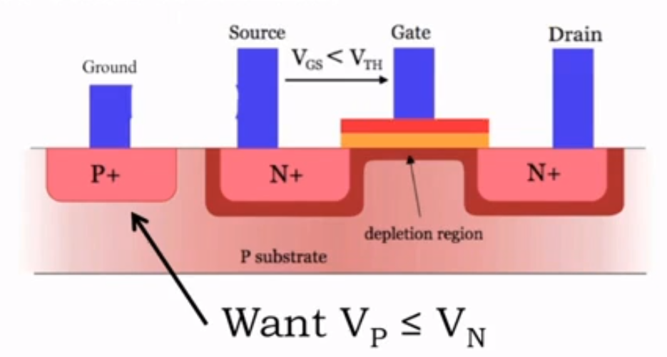
- substrate 必须 <= source 和 drain 的电压
- VGS = VG(gate 电压) - VS(Source 电压) < VTH (阈值电压)
- depletion 用于 substrate 和 源极/漏极 的绝缘层
  - 其宽度随 源极/漏极 电压的增大而增大
  
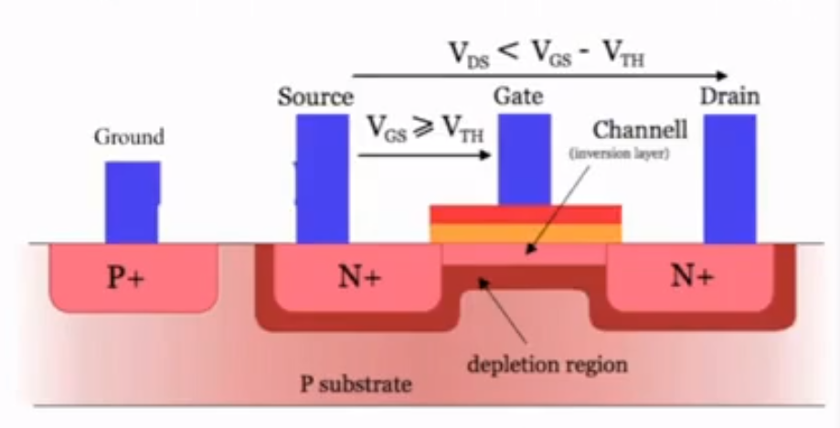
- VGS = VG - VS > VTH (阈值电压)
- 当积累了足够的电子，半导体类型由 p 型变成 n 型
  - 当正电压施加于栅极时，p型氧化物中也会感生电子，电子集中在氧化物边缘，看起来像个沟道
- 电流 Drain -> Source
- VDS < VGS - VTH
- I_DS = VDS / R

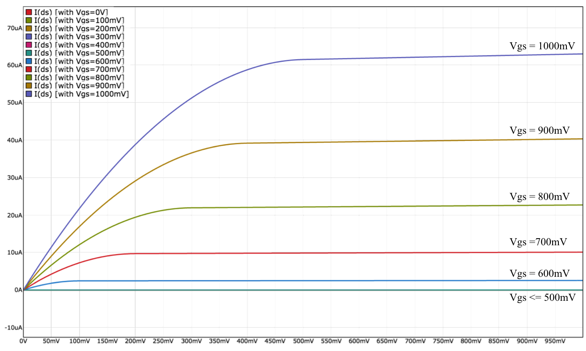
- VGS 增加，IDS 增加
- VDS 增加，IDS 增加，直到达到饱和
- R等效 = VDS/IDS 

## 两种 MOSFET
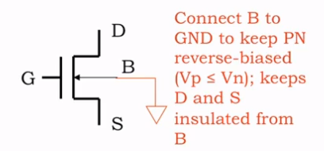
- B 始终接地以保证 substrate 必须 <= source 和 drain 的电压

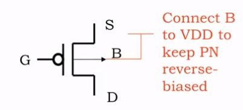
- 除了开关所有的电势都反转了

## 使用 MOSFET 实现简单的电压控制开关
两个规则
- 下拉电路中仅使用 n-channel MOSFET,简称为 NFET
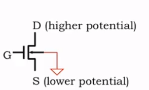
    - `off`
      - VGS < VTH
      - drain 和 source 没有连接
    - `on`
      - VGS > VTH
      - drain 和 source 导通，电阻取决于 VGS 的大小
    - GATE VS ON/OFF
      - "0" -> off
      - "1" -> on
- 上拉电路中仅使用 p-channel MOSFET,简称为 PFET
  - 用于连接信号，用于连接电源电压的节点 (V_DD)
  - 情况与 NFET 正好相反
  - `off`
    - VGS > VTH
  - `on`
    - VGS < VTH(VTH 为负)
  - GATE VS ON/OFF
    - "1" -> off
    - "0" -> on
## 逆变器设计
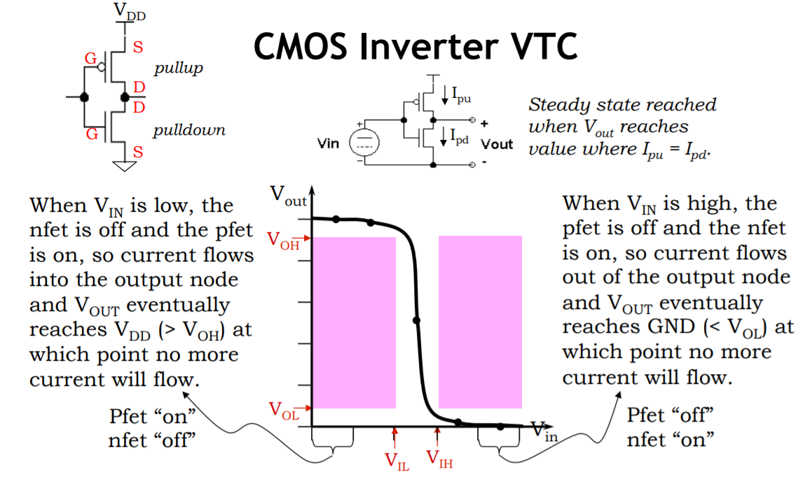

## beyond inverters
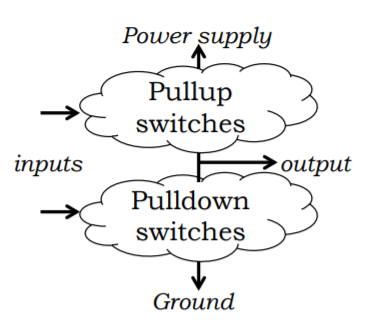

| pullup | pulldown | F(inputs) |
|:---:|:---:|:---:|
| on | off | driven “1” |
| off | on | driven “0” |
| on | on | driven “X” |
| off | off | no connection |

### 与或门

### 或非门

| A | B | Z |
|:---:|:---:|:---:|
| 0 | 0 | 1 |
| 0 | 1 | 0 |
| 1 | 0 | 0 |
| 1 | 1 | 0 |

## CMOS 互补
- CMOS 的上拉电路是其下拉电路的补充
  - 串联变并联，并联变串联
  - NFET 替换为 PFET

## CMOS 都是反相的
- CMOS 门都是反相的
- 单个CMOS逻辑门（形成上拉的 PFET 任意组合和形成下拉的 NFET 任意组合）只能实现反向功能
  - NOT(F) = A + BC 是单个 CMOS 逻辑门
  - NOT(F) = A + NOT(B)C 不是单个 CMOS 逻辑门
  
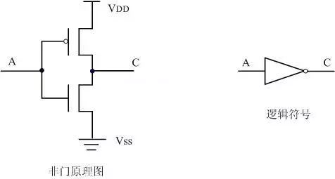

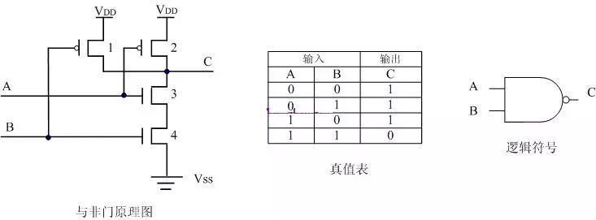

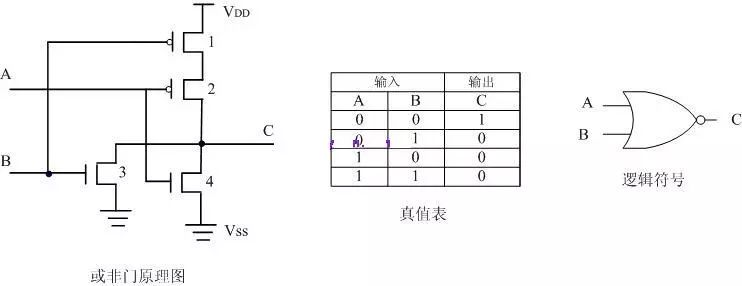

## CMOS 时序规范
### 传播延迟(从任何有效输入到有效输出的延迟的上限。)   
IN 已经变成有效输入了，OUT 还需要变成有效输出的时间上限是传播延迟。  

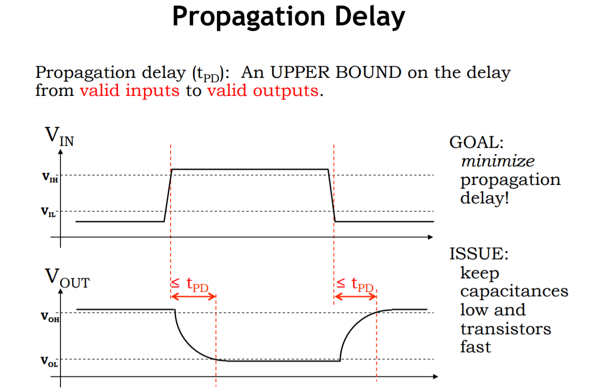

### 污染延迟(从任何无效输入到无效输出的延迟的下限。)
IN 开始变得无效时开始计时，直到 OUT 也开始变得无效  
也被称为最小传播延迟

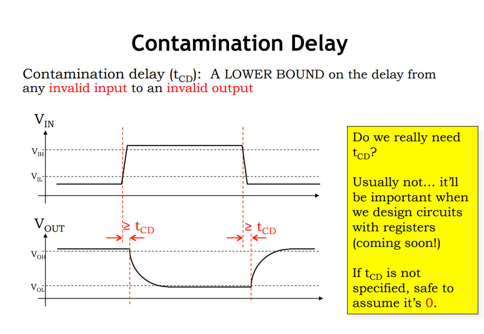

### the combination contract
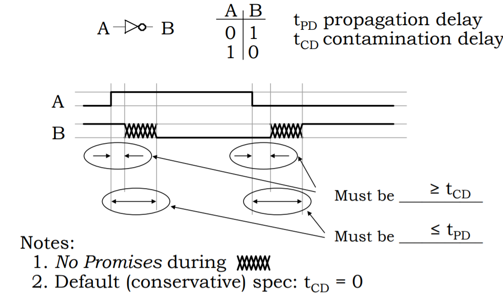
- 延迟一定在 thttps://learning.edx.org/course/course-v1:MITx+6.004.1x_3+3T2016/block-v1:MITx+6.004.1x_3+3T2016+type@sequential+block@c7s1/block-v1:MITx+6.004.1x_3+3T2016+type@vertical+block@c7s1v4CD 之后
- 延迟一定在 tPD 之前

## lenient(宽容) gates
- 所有 CMOS 都是宽容门

- 表现上

| A | B | Z |
|:---:|:---:|:---:|
| 0 | 0 | 1 |
| 0 | 1 | 0 |
| 1 | 0 | 0 |
| 1 | 1 | 0 |

- 实际上

| A | B | Z |
|:---:|:---:|:---:|
| 0 | 0 | 1 |
| X | 1 | 0 |
| 1 | X | 0 |
- X 代表任意值

## exercise
单个 CMOS 门由 F(A,B,C,D) 组成，观察到 F(1,0,1,1) = 1, 求 F(1,0,0,0)

- CMOS 门由一个输出节点组成，输出节点连接仅包含 PFET 的上拉电路和仅包含 NFET 的下拉电路
- 所有的 CMOS 门都是反相的
  - F(0,0,0,0) = 1
  - F(1,1,1,1) = 0
- F(1,0,1,1) -> F(1,0,0,0)
  - 更多的 1 变成 0
  - 打开更多的 PFET，关闭更多的 NFET
    - 上拉电路被拉到高电平的可能性变大
    - 下拉电路被拉到高输出的可能性变小
  - F(1,0,1,1) 已经是 1，所有 F(1,0,0,0) = 1
  
### 逆变器总是宽大的
- 逆变器（反相器）只有一个输入
- 如果门的输出不会因为一个不会影响输出的输入发生故障，那么门是宽大的
- 逆变器只有一个输入，没有不相关的输入
- 逆变器的输出都是由于输入的改变而发生
- 因此，逆变器是宽大的