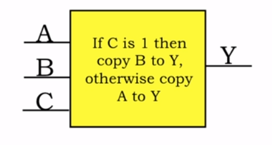
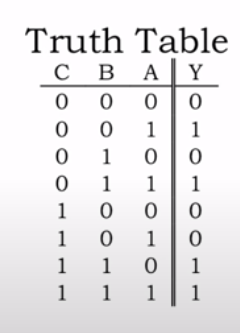
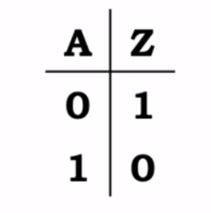
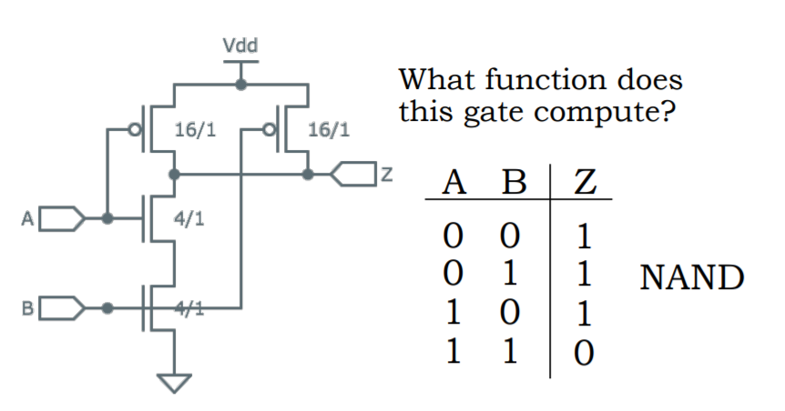
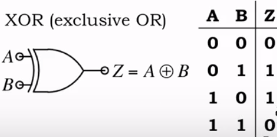

# combination logic
学习各种用于创建组合逻辑电路的技术

## 功能规范
有多种方法定义一个组合逻辑设备

### 自然语言表示

### 真值表

### 布尔表达式

- + 相当于 或
- · 相当于 与

## 组合逻辑门

### 逆变器

### AND

### OR

### 布尔表达式的组合逻辑们

## 不同的电路设计选择

`Z = A·B·C·D`

很难选择，除非知道 ABCD 的到达时间：
- 上面的传播延迟为N-1，但不要求 ABCD 同时到达
- 下面的传播延迟为logN，但要求 ABCD 同时到达

## 更多的常用组合门

### NAND(not AND)

### NOR(not or)

### XOR(exclusive OR) 异或

