# combination logic
学习各种用于创建组合逻辑电路的技术

## 功能规范
有多种方法定义一个组合逻辑设备
- 自然语言表述
- 真值表
- 布尔表达式

### 自然语言表示

### 真值表

### 布尔表达式

- `+` 相当于 或
- `·` 相当于 与

## 组合逻辑门

### 逆变器

### AND

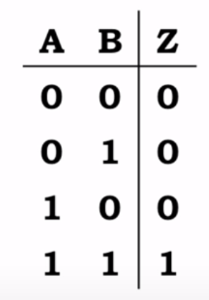

### OR

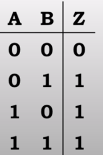

### 布尔表达式的组合逻辑们

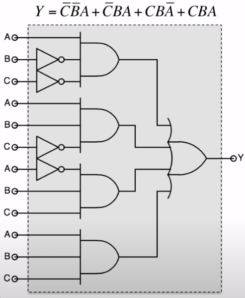

## 不同的电路设计选择

`Z = A·B·C·D`

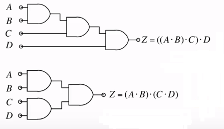

上面两个无法轻易分出好坏，除非知道 ABCD 的到达时间：
- 上面的传播延迟为N-1，但不要求 ABCD 同时到达
- 下面的传播延迟为logN，但要求 ABCD 同时到达

## 更多的常用组合门

### NAND(not AND)

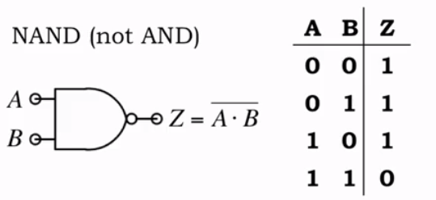

### NOR(not or)
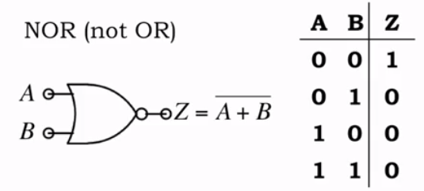

### XOR(exclusive OR) 异或

## `Z = A · B · C · D` 的 CMOS 设计

正向门尺寸小，tPD 大，是因为宽度较小。

反向门尺寸大，tPD 小，是因为宽度较大。

用德·摩根定律组成速度较快的 CMOS  
德·摩根定律：

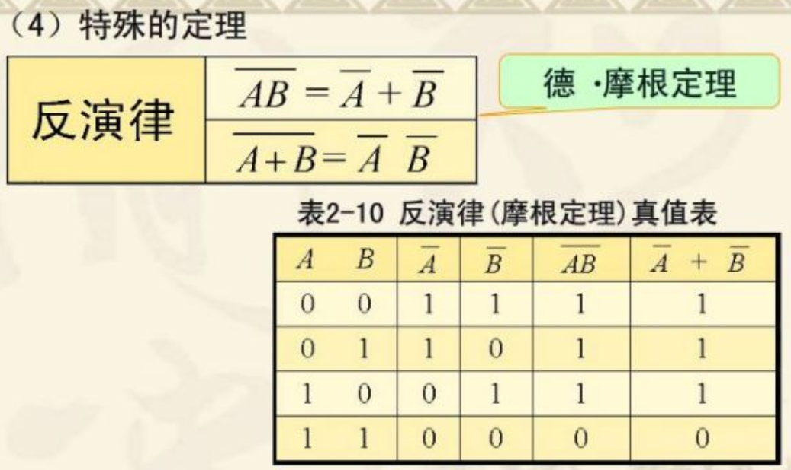

## 逻辑简化

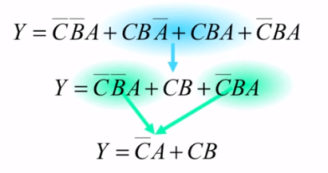

逻辑简化可以用计算机来完成

也可以使用 DONT CARES 表格

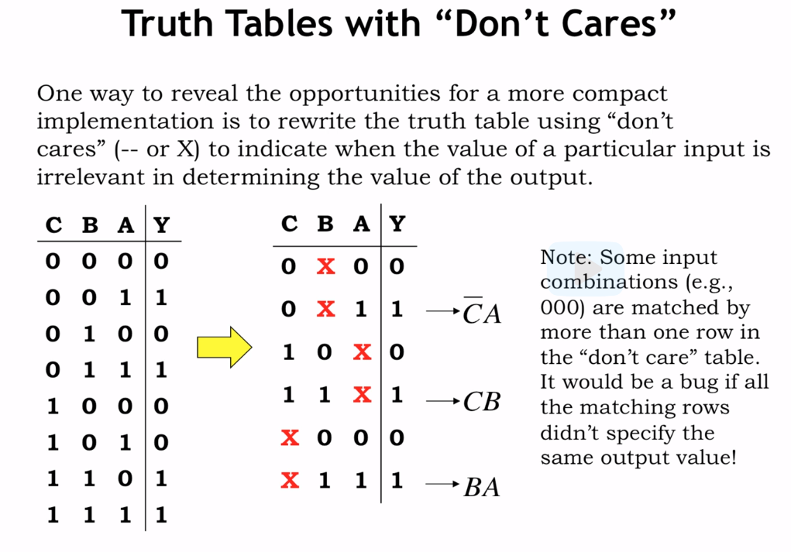

如由第一行，第三行可得，AC都为0时，B为0或1，Y都为0。以此来简化 Truth Table。

## Glitch

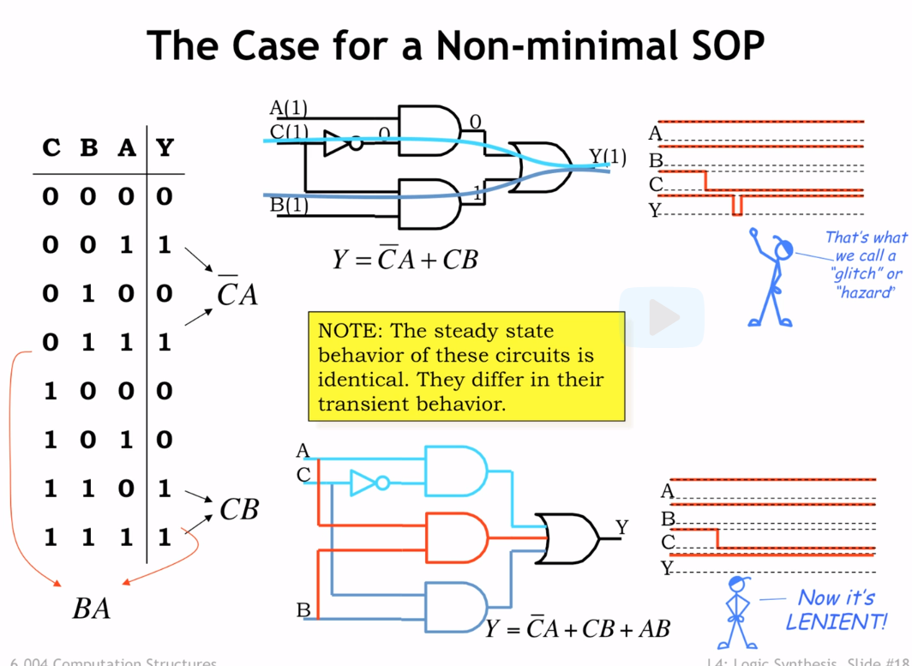

ABC都为1，C由 1 变为 0，Y 不变  
由于传播延迟，上面的图的 C 上半部分多走了个反相器，导致或门出现短暂的 0、0 输入，导致结果为 0，这种情况称为 Glitch

如果加上 AB，AB 为 1 的时候 Y 一直为1

### 如何知道要加哪些Boolean expression才能解决glitch呢？
可以采用Karnaugh map（卡诺图）

## Karnaugh map（卡诺图）

1. Karnaugh map 是一种描述逻辑函数特殊方格图。
2. 每格代表一个最小项
3. 上下左右相邻就具备相邻性。
4. 有 n 个变量，最小项为 2^n，卡诺图也由 2^n 个格子构成。
5. 变量太多时卡诺图太复杂，一般说来变量个数 > 4 时该法已不适用

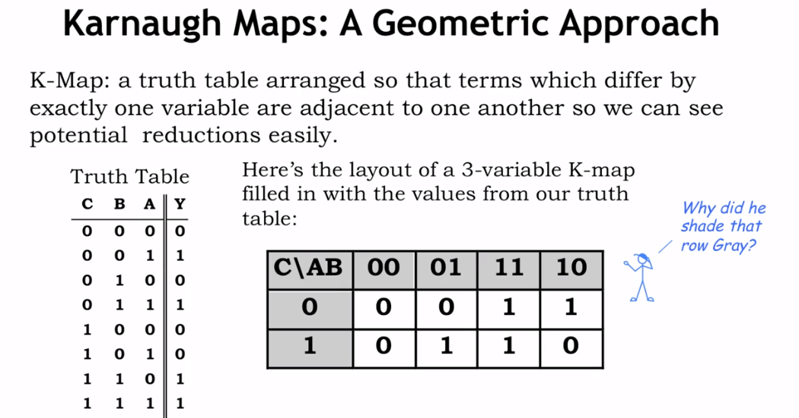

- [卡诺图化简法](https://blog.csdn.net/hahasusu/article/details/88244155)
  1. 列出逻辑函数的最小项表达式
  2. 画出卡诺图，消除变量
     - 卡诺图中两个相邻1格的最小项可以合并成一个与项，并消去一个变量。
     - 卡诺图中四个相邻1格的最小项可以合并成一个与项，并消去两个变量。
     - 卡诺图中八个相邻1格的最小项可以合并成一个与项，并消去三个变量。
  3. 圈的个数应尽可能得少，圈的面积越大越好
  4. 每个圈内至少有一个新的一格

### K-Map 帮助发现 Glitch
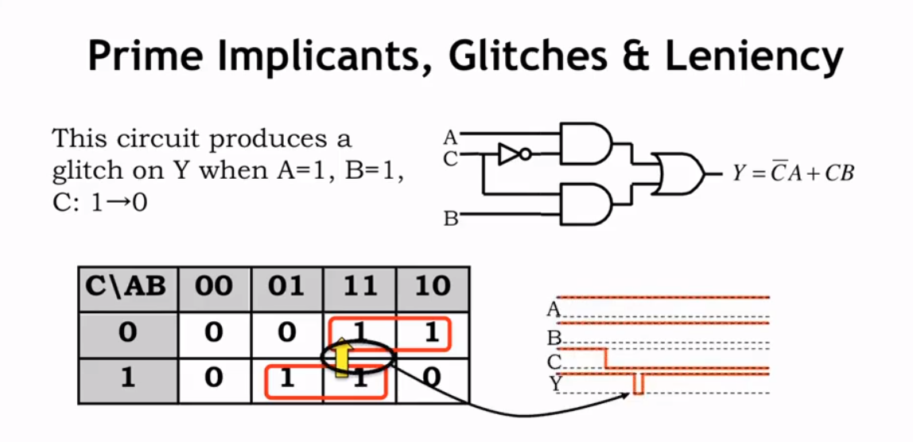

## MUX(multiplexer，即数据选择器)

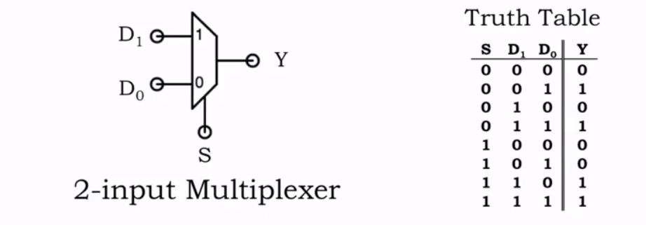

通过改变 s 可以选择输出 D1 还是 D0 的数  
以此，我们可是设计出更大的数据选择器

A,B,Cin 相当于 s, 这就设计了可调整的 8 路数据选择器。根据输入的 s 可以自定义输出 0 或 1

但 input 的大小跟输入的变量呈 2^N 的关系，因此当输入变量大于 6 则不实用

我们也可以用MUX来表示INVERTER，AND和OR

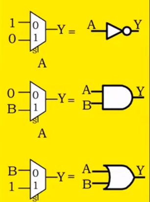

## ROM (只读存储器)
- 有多个 input 和一个 output 时，可以使用 MUX 来实现  
- 有多个 input 和多个 output 时，可以使用 ROM 来实现

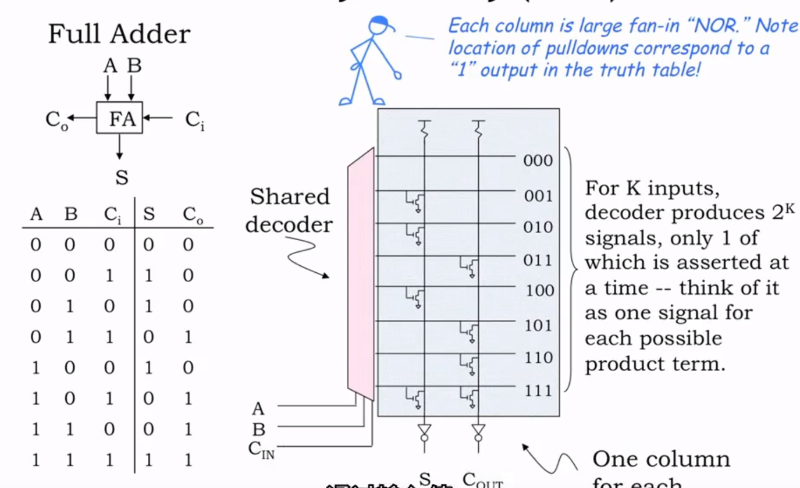

为了避免column太长导致选择速度变慢，可以将 A,B 作为 decoder 的 input， Cin 将作为 S 的 MUX 的input

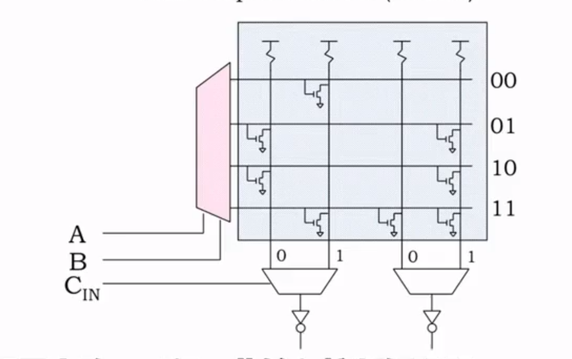

- Cin 为 0 输出 A, Cin 为 1 输出 B
- column 最上面接电源，为 1 

## 总结
- Sum of products
  - 任何 function 都也可以由 truth table 定制，快而小
- Mux and ROM
  - 独立于要实现的特定功能
  - 可以在制造后设置
  - 适合原型设计，小批量生产，可能需要更新功能的设备