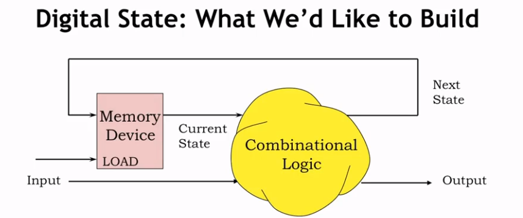
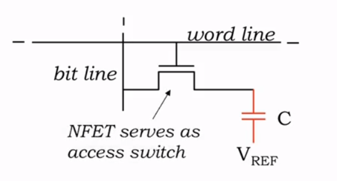
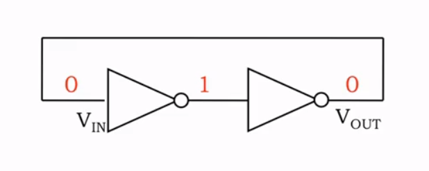
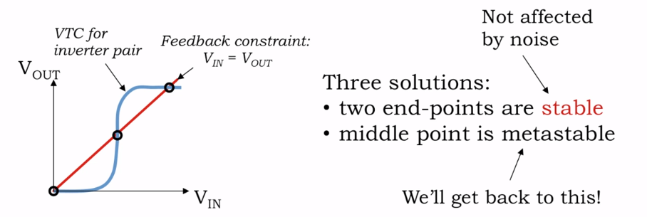

# Sequential Logic（顺序逻辑）

假设有一种新的需求：
- 当灯是开的，按按钮之后使灯关闭
- 当灯是关的，按下按钮后使灯打开

无法使用 combinational logic 去解决这种需求，因为 
1. 灯的开关状态并不取决于 input，而是取决于之前的 state
   - 对于相同的 input, 根据 state 的不同会有不同的 output
2. 我们现在面对的需求是“单击按钮”，而不是“按紧按钮”或者“松开按钮”
   - input 是一种 event，而不是一种 level。

因此我们需要引入 sequential logic 来解决这个问题。

Combinational Logic 有两个输入，产生两组输出
- **当前状态**和**当前输入值**一起作为顺序逻辑的输入
- 两个输出：
  - 用和 Current State 相同位数输出设备的**Next State**
  - 设备的**OUTPUT**
  
Memory Device 有两个输入，一个输出
- LOAD 控制信号：LOAD 解决 什么时候用 next state 代替 current state，用什么代替
  - 由 **Next State 和 LOAD 控制信号的输入值**产生 Current State

Memory Device 有 bits 为单位的储存空间
- 如果能储存 K 位，Memory Device 最多有 2^K 个状态
 
## 如何设计出能储存状态的 Memory Device

### 使用电容器
bits 是用电压表示的 (0V 表示 0，3V 表示 1)，因此考虑用电容来储存特定电压

电容器一端连接某个稳定的参考电压 Vref  
电容器的另一端连接 NFET，NFET 的 Gate 连接 word line

要将一些信息写入设备：
- bit line 连接预定的电压 (digit 0 or digit 1)
- 把 word line 调高使得 NFET 打开
- 电容器充电或放电，总之达到了与 bit line 相同的电压
- 达到以后， word line 调低以关闭 NFET，理想情况下电荷会无期限停留在电容上

要访问储存的信息：
- bit line 达到某个中间电压
- 把 word line 调高使得 NFET 打开
- bit line 变高 -> 电容器储存的是 1
- bit line 变低 -> 电容器储存的是 0
- 但这种变化是很小的，要用到一种非常灵敏的放大器（感应放大器），

优点：
- 电容器价格便宜
缺点
- 交互复杂，access 时间长
- 外部电气噪音会导致电容器的电荷变化
- NFET 有漏电流，即使正式关上也没有关紧，需要反复读取和重写储存值以定期刷新内存

### 改进：bi-stable storage
使用 positive feedback 来永久维护 storage

这是 双稳态存储元件 (bi-stable storage)，这个逻辑门是为了恢复边缘信号电平而建立的，所以噪声不是问题

- 两端是稳定的，因此不会被噪音影响
- 中间是介稳态，总会滑向两端中的任意一端

## 设计顺序逻辑的方法
